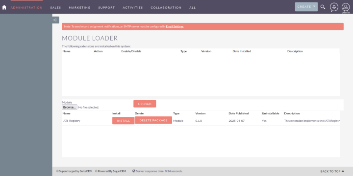

# IATI Registry SuiteCRM Extension


## Summary

 Product  | IATI Registry SuiteCRM Extension 
--- | ---
Description |The (new) IATI Registry is a CIAM system using a CRM ([SuiteCRM](https://github.com/salesagility/SuiteCRM)) to store IATI organisation and dataset information, and an identity service ([WSO2](https://github.com/wso2/product-is)).  To use SuiteCRM to store information about organisations, datasets and related actions on the corpus, this extension implements a set of custom Modules customisations for SuiteCRM to suit the IATI use case.
Website |None
Related |To spin up a local development environment of the new IATI Registry: [IATI Registry Local Development Environment](https://github.com/IATI/iati-registry-localdev).<br />To interact with the SuiteCRM API using Python there is a Python library: [IATI SuiteCRM Python Library](https://github.com/IATI/iati-registry-libsuitecrm)
Documentation |Currently, the rest of this README
Technical Issues |[GitHub issues page](https://github.com/IATI/iati-registry-suitecrm-extension/issues)
Support |[IATI Support Website](https://iatistandard.org/en/guidance/get-support/)

## High-level requirements

Operation:
* SuiteCRM v7

Build:
* Python (>=3.12.6 as specified in `.python-version`)
* PHP
* Make

## Getting started
### Installation

Logged into a fresh installation of SuiteCRM navigate to the *Module Loader* section in the *Administration* page; this is accessible via the user icon in the top-right of the page and following the *Admin* link.

Browse for the extension zip file, `dist/iati-registry-suitecrm-extension.zip`, and click upload.  Then select Install.  You will need to accept the license terms before proceeding.



After that you should see "Module Installed Successfully" then click on the home icon at the top of the screen to return to the home page of the CRM.


### Rebuilding
To rebuild the extension from scratch use the provided `Makefile`.

The extension relies on a set of custom application strings (`./custom/application/language/_override_en_us.IATI.php`) that include various dropdown menus for [code list](https://iatistandard.org/en/iati-standard/203/codelists/) items and other such information.  This file is built with the `build_app_strings.py` script that fetches codelists from the [IATI Standard](https://iatistandard.org/en/guidance/developer/codelist-api/) and also incorporates other strings in `./language_app_strings_base.py`.

#### Simple rebuild with no language string changes

If no changes have been made to code lists, or other drop downs, or the base `language_app_strings_base.py` file then there is no need to rebuild the custom language file.  In this case the extension can easily be rebuilt via:

```
make
```

### Rebuilding custom application strings
This is run using `make rebuild_strings` but the appropriate Python packages should be installed first with:

```
pip install -r requirements.txt
```

### Full rebuild

A full rebuild can be achieved with:

```
make clean
make all
```

The `all` target includes `rebuild_strings`.

## Development

### PHP Linting

PHP linting is carried out with [PHP-CS-Fixer](https://github.com/PHP-CS-Fixer/PHP-CS-Fixer/tree/master) and requires PHP to be installed.  From the command line:

```
composer install
./vendor/bin/php-cs-fixer fix custom
./vendor/bin/php-cs-fixer fix manifest.php
```

### Python Linting

Python linting is carried out with `isort`, `black` and checked with `flake8`.  The configuration of these is in `./pyproject.toml`.

```
isort build_app_strings.py
black build_app_strings.py
flake8 build_app_strings.py
```


## License
    The IATI Registry SuiteCRM Extension was developed by Open Data Services Cooperative Ltd.
    in its work for the IATI Secretariat and includes code automatically generated by SuiteCRM.
    
    SugarCRM Community Edition is a customer relationship management program developed by
    SugarCRM, Inc. Copyright (C) 2004-2013 SugarCRM Inc.
    
    SuiteCRM is an extension to SugarCRM Community Edition developed by SalesAgility Ltd.
    Copyright (C) 2011 - 2018 SalesAgility Ltd.
    
    This program is free software; you can redistribute it and/or modify it under
    the terms of the GNU Affero General Public License version 3 as published by the
    Free Software Foundation with the addition of the following permission added
    to Section 15 as permitted in Section 7(a): FOR ANY PART OF THE COVERED WORK
    IN WHICH THE COPYRIGHT IS OWNED BY SUGARCRM, SUGARCRM DISCLAIMS THE WARRANTY
    OF NON INFRINGEMENT OF THIRD PARTY RIGHTS.
    
    This program is distributed in the hope that it will be useful,
    but WITHOUT ANY WARRANTY; without even the implied warranty of
    MERCHANTABILITY or FITNESS FOR A PARTICULAR PURPOSE.  See the
    GNU Affero General Public License for more details.
    
    You should have received a copy of the GNU Affero General Public License along with
    this program; if not, see http://www.gnu.org/licenses or write to the Free
    Software Foundation, Inc., 51 Franklin Street, Fifth Floor, Boston, MA
    02110-1301 USA.
    
    You can contact SugarCRM, Inc. headquarters at 10050 North Wolfe Road,
    SW2-130, Cupertino, CA 95014, USA. or at email address contact@sugarcrm.com.
    
    The interactive user interfaces in modified source and object code versions
    of this program must display Appropriate Legal Notices, as required under
    Section 5 of the GNU Affero General Public License version 3.
    
    In accordance with Section 7(b) of the GNU Affero General Public License version 3,
    these Appropriate Legal Notices must retain the display of the "Powered by
    SugarCRM" logo and "Supercharged by SuiteCRM" logo. If the display of the logos is not
    reasonably feasible for technical reasons, the Appropriate Legal Notices must
    display the words "Powered by SugarCRM" and "Supercharged by SuiteCRM".
